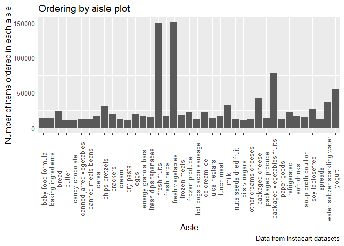
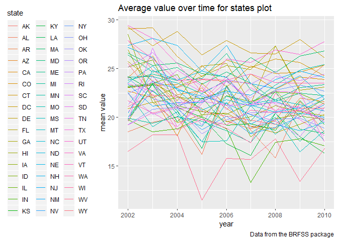
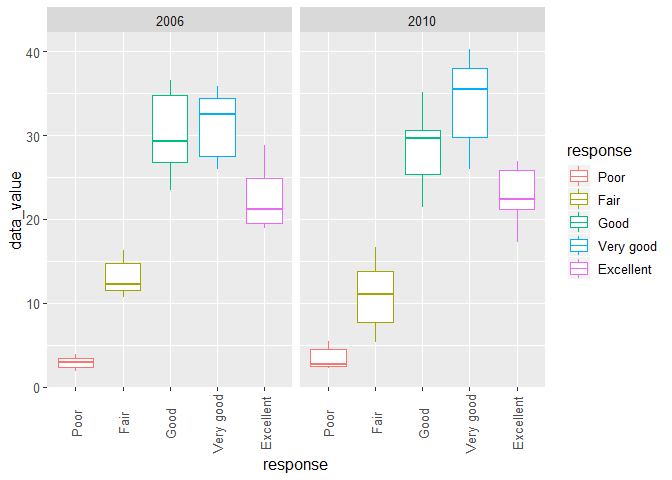
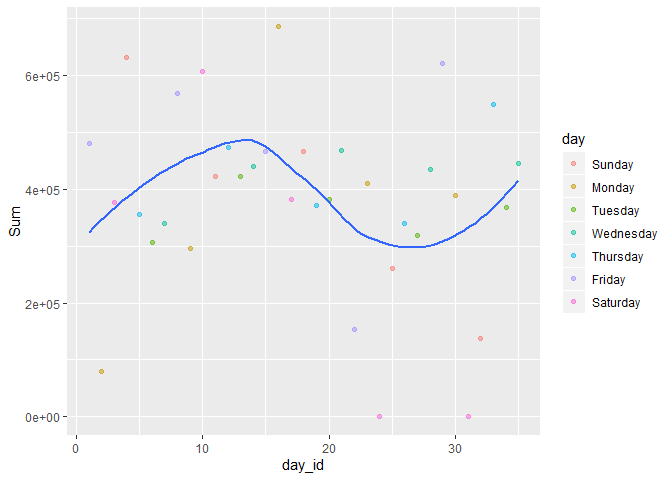

p8105\_hw3\_yq2251
================
TritonD
10/12/2019

``` r
library(tidyverse)
```

    ## -- Attaching packages ----------------------------------------- tidyverse 1.2.1 --

    ## v ggplot2 3.2.1     v purrr   0.3.2
    ## v tibble  2.1.3     v dplyr   0.8.3
    ## v tidyr   1.0.0     v stringr 1.4.0
    ## v readr   1.3.1     v forcats 0.4.0

    ## -- Conflicts -------------------------------------------- tidyverse_conflicts() --
    ## x dplyr::filter() masks stats::filter()
    ## x dplyr::lag()    masks stats::lag()

``` r
library(ggridges)
```

    ## 
    ## Attaching package: 'ggridges'

    ## The following object is masked from 'package:ggplot2':
    ## 
    ##     scale_discrete_manual

``` r
library(patchwork)
library(knitr)
library(tidyr)
library(readxl)
```

## Problem 1

``` r
library(p8105.datasets)
data("instacart")
```

\*\*This instacart dataset contains 1,384,617 entries within 15 total
columns.Some key variables include “asile” as a product category,
“order\_hour\_of\_day” which recognize people’s ordering preferance in
the time of a day.

## count how many aisles there are

``` r
instacart %>%
  group_by(aisle) %>%
  summarize(aisle_n = n())
```

    ## # A tibble: 134 x 2
    ##    aisle                  aisle_n
    ##    <chr>                    <int>
    ##  1 air fresheners candles    1067
    ##  2 asian foods               7007
    ##  3 baby accessories           306
    ##  4 baby bath body care        328
    ##  5 baby food formula        13198
    ##  6 bakery desserts           1501
    ##  7 baking ingredients       13088
    ##  8 baking supplies decor     1094
    ##  9 beauty                     287
    ## 10 beers coolers             1839
    ## # ... with 124 more rows

## find out which aisle is most popular

``` r
instacart %>%
  group_by(aisle) %>%
  summarize(aisle_n = n())%>%
filter(min_rank(desc(aisle_n)) < 2)
```

    ## # A tibble: 1 x 2
    ##   aisle            aisle_n
    ##   <chr>              <int>
    ## 1 fresh vegetables  150609

\*\*There are 134 aisles in total, with “fresh vegetables” as the aisle
with most items ordered from
(n=150609).

## Make a plot that shows the number of items ordered in each aisle with n\>10000

``` r
instacart %>%
  group_by(aisle) %>%
  summarize(aisle_n = n())%>%
filter(aisle_n > 10000)%>%
ggplot(aes(x=aisle, y=aisle_n)) +
  geom_bar(stat="identity") +
  theme(text = element_text(size=12),
         axis.text.x = element_text(angle=90, vjust=0.5)) +
  labs(
    title = "Ordering by aisle plot",
    x = "Aisle",
    y = "Number of items ordered in each aisle",
    caption = "Data from Instacart datasets"
  )
```

<!-- -->

\*\*In the bar chart title “Ordering by asile plot”, x-axis is the 39
aisle names with more than 10000 items ordered, y-axis is the number of
items ordered in each aisle with 50000 as a break.

## make a table for 3 most popular items in each of the 3 aisles

``` r
instacart %>%
  filter(aisle == c("baking ingredients", "dog food care", "packaged vegetables fruits")) %>% 
  group_by(aisle, product_name) %>% 
  summarize(product_count = n())%>%
  filter(min_rank(desc(product_count)) < 4)%>%
  knitr::kable(digits = 0)
```

| aisle                      | product\_name                                   | product\_count |
| :------------------------- | :---------------------------------------------- | -------------: |
| baking ingredients         | Light Brown Sugar                               |            157 |
| baking ingredients         | Organic Vanilla Extract                         |            122 |
| baking ingredients         | Pure Baking Soda                                |            140 |
| dog food care              | Organix Chicken & Brown Rice Recipe             |             13 |
| dog food care              | Organix Grain Free Chicken & Vegetable Dog Food |             14 |
| dog food care              | Original Dry Dog                                |              9 |
| packaged vegetables fruits | Organic Baby Spinach                            |           3324 |
| packaged vegetables fruits | Organic Blueberries                             |           1692 |
| packaged vegetables fruits | Organic Raspberries                             |           1920 |

\*\*The three most popular items in “baking ingredients” aisle are Light
Brown Sugar,Organic Vanilla Extract and Pure Baking Soda. The three most
popular items in “dog food care” aisle are Organix Chicken & Brown Rice
Recipe, Organix Grain Free Chicken & Vegetable Dog Food and Original Dry
Dog. The three most popular items in “packaged vegetables fruits” aisle
are Organic Baby Spinach, Organic Blueberries and Organic Raspberries.
“Product\_count” indicates number of products ordered for each product
name.

## Make a table showing the mean hour of the day

``` r
instacart %>%
  filter(product_name %in% c("Pink Lady Apples", "Coffee Ice Cream")) %>% 
  group_by(product_name,order_dow) %>% 
  summarize(mean_time = mean(order_hour_of_day))%>%
   pivot_wider(
    names_from = order_dow,
    values_from = mean_time) %>% 
  rename(Sunday="0", Monday="1", Tuesday="2", Wednesday="3", Thursday="4", Friday="5", Saturday="6")%>%
  knitr::kable(digits = 0)
```

| product\_name    | Sunday | Monday | Tuesday | Wednesday | Thursday | Friday | Saturday |
| :--------------- | -----: | -----: | ------: | --------: | -------: | -----: | -------: |
| Coffee Ice Cream |     14 |     14 |      15 |        15 |       15 |     12 |       14 |
| Pink Lady Apples |     13 |     11 |      12 |        14 |       12 |     13 |       12 |

\*\* This 2\*7 table shows the mean hour of the day in the week when
Pink Lady Apples and Coffee Ice Cream were ordered. According to the
table, Coffee Ice Cream were usually purchased later in the day compared
to Pink Lady Apples, which fits the general trend that vege/fruits are
usually ordered earlier i the day comparing to ice cream/pizza.

## problem 2

``` r
library(p8105.datasets)
data("brfss_smart2010")
```

## clean the dataset

``` r
data("brfss_smart2010")
brfss_new=
  filter(brfss_smart2010,Topic=="Overall Health")%>%
  janitor::clean_names() %>%
  rename("state"=locationabbr)%>%
  mutate(
    response=as.factor(response),
    response = forcats::fct_relevel(response, c("Poor","Fair","Good", "Very good","Excellent")))
```

## In 2002, which states were observed at 7 or more locations? What about in 2010?

``` r
brfss_new %>%
  filter(year == 2002)%>%
  group_by(state)%>%
 summarize(n_location=n_distinct(locationdesc), no.rm=FALSE)%>%
  filter(n_location>=7)%>%
  knitr::kable()
```

| state | n\_location | no.rm |
| :---- | ----------: | :---- |
| CT    |           7 | FALSE |
| FL    |           7 | FALSE |
| MA    |           8 | FALSE |
| NC    |           7 | FALSE |
| NJ    |           8 | FALSE |
| PA    |          10 | FALSE |

\*In 2002, state CT,FL,MA,NC,NJ,PA have 7 or more locations recorded.

``` r
brfss_new %>%
  filter(year == 2010)%>%
  group_by(state)%>%
 summarize(n_location=n_distinct(locationdesc), no.rm=FALSE)%>%
  filter(n_location>=7)%>%
  knitr::kable()
```

| state | n\_location | no.rm |
| :---- | ----------: | :---- |
| CA    |          12 | FALSE |
| CO    |           7 | FALSE |
| FL    |          41 | FALSE |
| MA    |           9 | FALSE |
| MD    |          12 | FALSE |
| NC    |          12 | FALSE |
| NE    |          10 | FALSE |
| NJ    |          19 | FALSE |
| NY    |           9 | FALSE |
| OH    |           8 | FALSE |
| PA    |           7 | FALSE |
| SC    |           7 | FALSE |
| TX    |          16 | FALSE |
| WA    |          10 | FALSE |

\*In 2010, state CA,CO,FL,MA,MD,NC,NE,NJ,NY,OH,PA,SC,TX,WA have 7 or
more locations
recorded.

## Construct a dataset that is limited to Excellent responses, and contains, year, state, and a variable that averages the data\_value.

``` r
brfss_excellent=
  filter(brfss_new, response == "Excellent")%>%
  group_by(year,state)%>%
  mutate(mean=mean(data_value, na.rm=FALSE, digits=2))%>%
  select(year,state,mean)%>%
  distinct()
```

\*In this newly created dataset “brfss\_excellent”, there are 443
entries within 3 total columns, ranging from year
2002-2010.

## create the spaghetti plot of this average value over time within a state

``` r
brfss_excellent %>%
  ggplot(aes(x=year,y=mean, color=state)) + 
    geom_line()+
  labs(
    title = "Average value over time for states plot",
    x = "year",
    y = "mean value",
    caption = "Data from the BRFSS package"
  ) +
  theme(legend.position = "left")
```

    ## Warning: Removed 3 rows containing missing values (geom_path).

<!-- -->

  - For this spaghetti graph, x-axis is year, y-axis is the mean value
    of data\_value with different colors represent different
states.

## Make a two-panel plot showing, for the years 2006, and 2010, distribution of data\_value for responses (“Poor” to “Excellent”) among locations in NY State

``` r
brfss_new %>%
  filter(state == "NY", year %in% c(2006,2010))%>%
ggplot(aes(x = response, y = data_value, color=response)) + 
  geom_boxplot()+
   theme(text = element_text(size=12),
         axis.text.x = element_text(angle=90, vjust=0.5))+
  facet_grid(. ~ year)
```

<!-- -->

\*I choose to use a boxplot because it can show the distribution of
data\_value clearly. The general trend of responses distribution is
similar between year 2006 and 2010. In year 2010, there were more “very
good” response" than “good” response comparing to 2006.

## problem 3

## clean the data with a weekday vs weekend variable

``` r
accel=read_csv("data/accel_data.csv")%>%
 janitor::clean_names()%>%
  mutate(day = as.factor(day),
         day = forcats::fct_relevel(day, c("Sunday","Monday","Tuesday", "Wednesday","Thursday", "Friday", "Saturday"))) %>%
  mutate(daytype = case_when(
    day %in% c("Sunday","Saturday") ~ "weekend",
    day %in% c("Monday","Tuesday","Wednesday","Thursday","Friday") ~ "weekday"))%>%
  pivot_longer(
    activity_1:activity_1440,
    names_to = "time",
    names_prefix = "activity_",
    values_to = "activity"
  )
```

    ## Parsed with column specification:
    ## cols(
    ##   .default = col_double(),
    ##   day = col_character()
    ## )

    ## See spec(...) for full column specifications.

``` r
  mutate(accel, time = as.numeric(time))
```

    ## # A tibble: 50,400 x 6
    ##     week day_id day    daytype  time activity
    ##    <dbl>  <dbl> <fct>  <chr>   <dbl>    <dbl>
    ##  1     1      1 Friday weekday     1     88.4
    ##  2     1      1 Friday weekday     2     82.2
    ##  3     1      1 Friday weekday     3     64.4
    ##  4     1      1 Friday weekday     4     70.0
    ##  5     1      1 Friday weekday     5     75.0
    ##  6     1      1 Friday weekday     6     66.3
    ##  7     1      1 Friday weekday     7     53.8
    ##  8     1      1 Friday weekday     8     47.8
    ##  9     1      1 Friday weekday     9     55.5
    ## 10     1      1 Friday weekday    10     43.0
    ## # ... with 50,390 more rows

\*This dataset contains 1444 total columns with 35 entries.Variables
include week, day\_id, day and daytype, and activities 1-1440. “daytype”
indicates whether the day of the week is weekend or weekday.

## create daily total activity table

``` r
accel%>%
  group_by(week,day, day_id) %>%
  summarize(Sum=sum(activity))%>%
  knitr::kable()
```

| week | day       | day\_id |       Sum |
| ---: | :-------- | ------: | --------: |
|    1 | Sunday    |       4 | 631105.00 |
|    1 | Monday    |       2 |  78828.07 |
|    1 | Tuesday   |       6 | 307094.24 |
|    1 | Wednesday |       7 | 340115.01 |
|    1 | Thursday  |       5 | 355923.64 |
|    1 | Friday    |       1 | 480542.62 |
|    1 | Saturday  |       3 | 376254.00 |
|    2 | Sunday    |      11 | 422018.00 |
|    2 | Monday    |       9 | 295431.00 |
|    2 | Tuesday   |      13 | 423245.00 |
|    2 | Wednesday |      14 | 440962.00 |
|    2 | Thursday  |      12 | 474048.00 |
|    2 | Friday    |       8 | 568839.00 |
|    2 | Saturday  |      10 | 607175.00 |
|    3 | Sunday    |      18 | 467052.00 |
|    3 | Monday    |      16 | 685910.00 |
|    3 | Tuesday   |      20 | 381507.00 |
|    3 | Wednesday |      21 | 468869.00 |
|    3 | Thursday  |      19 | 371230.00 |
|    3 | Friday    |      15 | 467420.00 |
|    3 | Saturday  |      17 | 382928.00 |
|    4 | Sunday    |      25 | 260617.00 |
|    4 | Monday    |      23 | 409450.00 |
|    4 | Tuesday   |      27 | 319568.00 |
|    4 | Wednesday |      28 | 434460.00 |
|    4 | Thursday  |      26 | 340291.00 |
|    4 | Friday    |      22 | 154049.00 |
|    4 | Saturday  |      24 |   1440.00 |
|    5 | Sunday    |      32 | 138421.00 |
|    5 | Monday    |      30 | 389080.00 |
|    5 | Tuesday   |      34 | 367824.00 |
|    5 | Wednesday |      35 | 445366.00 |
|    5 | Thursday  |      33 | 549658.00 |
|    5 | Friday    |      29 | 620860.00 |
|    5 | Saturday  |      31 |   1440.00 |

  - In the newly created table, there are 35 rows with 4 columns.
    Variable“sum” indicates the total amount of activity each day.
    Variable “week” indicates which week is that specific day.The days
    are arranged from Sunday to
Saturday.

## create signle panel plot for 24-hour activity time courses for each day

``` r
accel_new = 
  accel %>%
  group_by(week,day, day_id) %>%
  summarize(Sum=sum(activity))

accel_new <- tibble::rowid_to_column(accel_new, "ID1")
```

``` r
accel_new%>%
 ggplot(aes(x = day_id, y = Sum)) +
  geom_point(aes(color = day), alpha = .5)+
   geom_smooth(se = FALSE)
```

    ## `geom_smooth()` using method = 'loess' and formula 'y ~ x'

<!-- -->

\*According to the plot, majority of the person’s daily activity
summation is around 400000, with couple Saturdays when there is nearly
none activities(sum of activity 1440). The maximum daily activity
occurred on a Monday with nearly 700000. Since I order the data based on
the real days happening, the person’s daily activity has a treand to
increase at the beginning of the month, then decreased, and finally
increased again.
